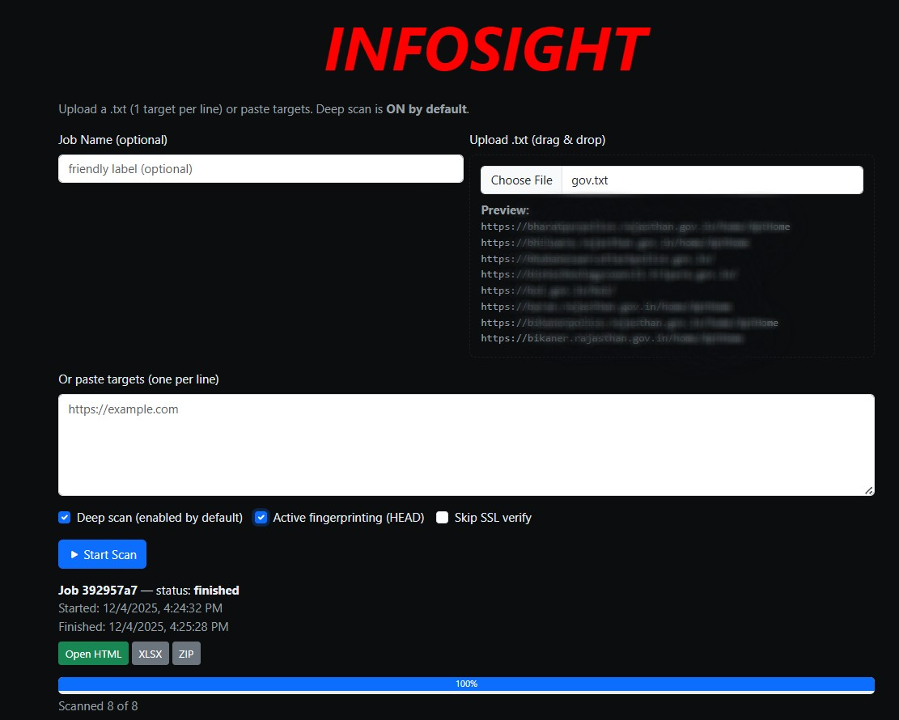

# INFOSIGHT
INFORMATION DISCLOSER volubility finder tool


# Exposure Scan

A powerful web application for scanning and identifying security exposures in web applications through header analysis, version detection, and vulnerability correlation.

## 🎯 Overview

Exposure Scan is a comprehensive security assessment tool that identifies potential vulnerabilities in web applications by:

- **Header Analysis**: Detecting version information in HTTP response headers
- **Deep Scanning**: Analyzing HTML meta tags, comments, and configuration files
- **Active Fingerprinting**: Probing common sensitive endpoints
- **CVE Correlation**: Automatically linking detected versions to known vulnerabilities
- **Batch Processing**: Scanning multiple targets efficiently with concurrent execution




## ✨ Features

### Core Capabilities
- 🔍 **Passive Reconnaissance**: HTTP header inspection and version detection
- 🕵️ **Deep Analysis**: HTML parsing for meta tags, comments, and embedded information
- 🎯 **Active Probing**: Optional HEAD requests to sensitive endpoints
- 🔗 **CVE Lookup**: Automatic vulnerability correlation via CVE CircL API
- 📊 **Multiple Export Formats**: HTML reports, Excel spreadsheets, JSON, and ZIP archives

### User Interface
- 🌓 **Dark/Light Theme**: Persistent theme preference
- 📤 **Drag & Drop Upload**: Easy target list management
- 📈 **Real-time Progress**: Live scanning status and progress tracking
- 🎨 **Responsive Design**: Mobile-friendly Bootstrap interface
- 🖼️ **Custom Branding**: Embedded logo support (base64 data URI)

### Security Features
- ✅ **SSL Verification**: Optional SSL certificate validation
- 🛡️ **Rate Limiting**: Built-in throttling for responsible scanning
- 🔐 **DNS Validation**: Pre-scan host resolution checks
- ⚠️ **Severity Classification**: High/Medium/Low risk categorization

## 🚀 Quick Start

### Prerequisites

- Python 3.8 or higher
- pip (Python package manager)

### Installation

1. **Clone or download the repository**
   ```bash
   git clone <repository-url>
   cd exposure-scan
   ```

2. **Install dependencies**
   ```bash
   pip install -r requirements.txt
   ```

3. **Add your logo (optional)**
   ```bash
   # Place your logo in the static directory
   mkdir -p static
   cp /path/to/your/logo.png static/logo.png
   ```

4. **Run the application**
   ```bash
   python exposure_scan_webapp_with_logo.py
   ```

5. **Access the web interface**
   ```
   Open your browser to: http://localhost:5000
   ```

## 📖 Usage Guide

### Basic Scanning

1. **Prepare Target List**
   - Create a text file with one target per line
   - Format: `https://example.com` or `example.com`
   - Maximum 5,000 targets per scan

2. **Configure Scan Options**
   - **Deep Scan** (enabled by default): Analyzes HTML, robots.txt, sitemap.xml
   - **Active Fingerprinting**: Sends HEAD requests to common endpoints
   - **Skip SSL Verify**: Bypasses certificate validation for testing

3. **Upload or Paste Targets**
   - Drag & drop a `.txt` file, or
   - Paste targets directly into the text area

4. **Start Scan**
   - Click "Start Scan"
   - Monitor real-time progress
   - View results as they complete

### Export Options

After scanning completes, export results in multiple formats:

- **HTML Report**: Interactive web-based report with full details
- **Excel (.xlsx)**: Structured spreadsheet with filterable columns
- **JSON**: Raw data for programmatic processing
- **ZIP**: Combined HTML + Excel archive

### API Usage

The application provides RESTful API endpoints:

```bash
# Start a scan
curl -X POST http://localhost:5000/api/scan \
  -H "Content-Type: application/json" \
  -d '{
    "targets": ["https://example.com"],
    "opts": {
      "deep": true,
      "active": false,
      "no_verify": false
    }
  }'

# Check scan status
curl http://localhost:5000/api/status/<job_id>

# Get results
curl http://localhost:5000/api/results/<job_id>

# Cancel running scan
curl -X POST http://localhost:5000/api/cancel/<job_id>
```

## 🔧 Configuration

### Environment Variables

```bash
# Change the listening port (default: 5000)
export PORT=8080

# Run the application
python exposure_scan_webapp_with_logo.py
```

### Custom Headers

Modify the `DEFAULT_HEADERS` list in the script to scan additional headers:

```python
DEFAULT_HEADERS = [
    "Server", 
    "X-Powered-By",
    "X-Custom-Header",  # Add custom headers here
    # ... more headers
]
```

## 🏗️ Architecture & Flow

### Application Flow

```
User Input → Job Creation → Concurrent Scanning → Results Processing → Export
     ↓            ↓               ↓                      ↓              ↓
  Upload      UUID Gen      ThreadPoolExecutor      Vulnerability   Multiple
  Targets     Job Queue     Max 10 Workers          Correlation     Formats
```

### Scanning Strategy

1. **Pre-scan Validation**
   - DNS resolution check
   - URL normalization (auto-prepend https://)

2. **Passive Analysis**
   - HTTP GET request to target
   - Header inspection with regex pattern matching
   - Version detection using multiple patterns

3. **Deep Inspection** (if enabled)
   - HTML meta tag parsing
   - Comment extraction with keyword filtering
   - robots.txt analysis for sensitive paths
   - sitemap.xml leak detection

4. **Active Probing** (if enabled)
   - HEAD requests to common endpoints:
     - `/server-status`, `/phpinfo.php`
     - `/.git/config`, `/.env`
     - `/wp-login.php`, `/admin`

5. **Vulnerability Correlation**
   - Automatic CVE lookup via CircL API
   - Product/version matching
   - Severity escalation for known CVEs

### Data Flow

```
Target URL
    ↓
DNS Check → HTTP Request → Response Analysis
                              ↓
                    ┌─────────┴─────────┐
                    ↓                   ↓
              Header Analysis    Body Analysis
                    ↓                   ↓
              Version Detection   HTML Parsing
                    ↓                   ↓
                    └─────────┬─────────┘
                              ↓
                      CVE Correlation
                              ↓
                      Severity Assessment
                              ↓
                      Finding Storage
```

## 🎨 Customization

### Logo Integration

Place your logo in `static/logo.png` (or any supported format):

```bash
static/
└── logo.png  # PNG, JPEG, or SVG
```

Supported formats:
- PNG (recommended)
- JPEG/JPG
- SVG

The logo is automatically:
- Encoded as base64 data URI
- Embedded in HTML templates
- Displayed at 48px height (responsive)

### Theme Customization

Modify CSS variables in `INDEX_HTML`:

```css
:root {
  --bg: #f6f7fb;        /* Background color */
  --card: #fff;         /* Card background */
  --muted: #6c757d;     /* Muted text */
  --text: #111;         /* Primary text */
}
```

## 📊 Output Format

### Excel Report Structure

| Column | Description |
|--------|-------------|
| url_index | Sequential target number |
| url | Full target URL |
| vulnerable | Yes/No indicator |
| header | Header or source name |
| value | Detected value |
| evidence | Extracted version string |
| product | Product name (if detected) |
| version | Version number (if detected) |
| severity | High/Medium/Low |
| cve_search_hint | Google search suggestion |

### Severity Levels

- **High**: Server header with version + Known CVEs
- **Medium**: Version disclosure in headers, meta tags, or sensitive comments
- **Low**: Generic information disclosure without version data

## 🛡️ Security Considerations

### Responsible Usage

- Always obtain proper authorization before scanning targets
- Respect robots.txt and security.txt policies
- Use appropriate rate limiting and delays
- Comply with applicable laws and regulations

### Rate Limiting

Built-in protections:
- Maximum 5,000 targets per job
- 10 concurrent workers (configurable)
- 6-10 second timeouts per request
- Automatic retry with SSL bypass (optional)

### Privacy

- All data stored in-memory (session-based)
- No persistent database or logs
- Jobs automatically cleared on restart
- No external data transmission (except CVE API)

## 🔍 Detection Patterns

### Version Extraction

1. **Product/Version Pattern**: `Product/1.2.3`
2. **Leading V Pattern**: `v1.2.3` or `V1.2.3`
3. **Generic Version**: `1.2.3` (with context validation)

### Interesting Keywords

HTML comment analysis flags:
- admin, login, wp-admin
- backup, .env, api_key, secret
- password, passwd
- sql error, exception, traceback
- ora-, mysql, jdbc

## 📝 License

This project is licensed under the MIT License - see the [LICENSE](LICENSE) file for details.

## 🤝 Contributing

Contributions are welcome! Please feel free to submit pull requests or open issues for bugs and feature requests.

### Development Setup

```bash
# Install development dependencies
pip install -r requirements.txt

# Run with debug mode
python exposure_scan_webapp_with_logo.py
# Debug mode is enabled by default in __main__
```

## 🐛 Troubleshooting

### Common Issues

**Issue**: Logo not displaying
- **Solution**: Ensure `static/logo.png` exists and is a valid image file

**Issue**: SSL verification errors
- **Solution**: Enable "Skip SSL verify" option for self-signed certificates

**Issue**: Scan stuck at 0%
- **Solution**: Check DNS resolution and firewall rules

**Issue**: No CVE results
- **Solution**: CVE API may be rate-limited; retry after delay

## 📚 References

- [CVE CircL API](https://cve.circl.lu/)
- [OWASP Top 10](https://owasp.org/www-project-top-ten/)
- [CWE-200: Information Exposure](https://cwe.mitre.org/data/definitions/200.html)

## 👥 Support

For issues, questions, or suggestions:
- Open an issue on GitHub
- Contact the development team
- Review documentation at [project website]

## 🎯 Roadmap

Future enhancements:
- [ ] Database persistence option
- [ ] Scheduled scanning
- [ ] Email notifications
- [ ] API authentication
- [ ] Custom rule engine
- [ ] Integration with vulnerability scanners
- [ ] Historical trend analysis

---

**Made with ❤️ for security professionals**


**Happy Hackinng!!!**